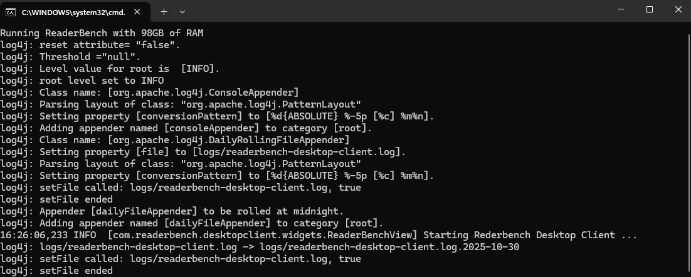
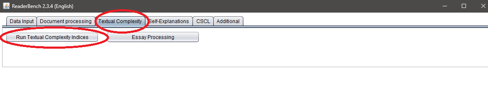
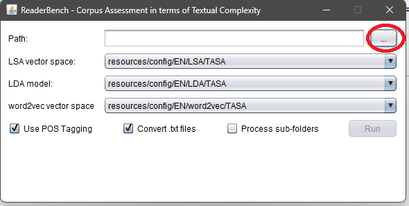
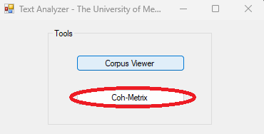
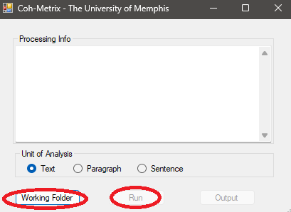
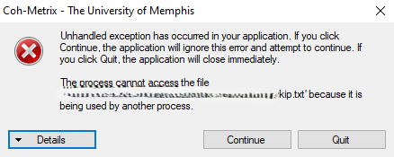
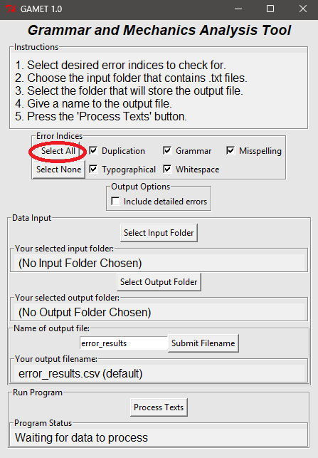

```{r setup, include=FALSE}
knitr::opts_chunk$set(collapse = TRUE, comment = "#>")
```

## Background

writeAlizer helps you turn text-analysis output into predicted writing scores. You first analyze your writing samples with ReaderBench, Coh-Metrix, or GAMET, then import that program's CSV file into R. writeAlizer applies existing scoring models and returns a table with one row per text.

This guide starts with a sample file so you can try the workflow before preparing your own data. If you need help with the analysis programs, jump to [preparing your files](#file-setup). For the research behind the scores, see [scoring model development](scoring-model-development.html).

## Choose a model

Start with the model that matches your analysis file:

| Your CSV comes from | Use this model | Scores returned |
|---|---|---|
| ReaderBench (Java version) | `rb_mod3all` | Overall writing quality and three genre scores |
| Coh-Metrix 3.0 | `coh_mod3all` | Overall writing quality and three genre scores |
| GAMET 1.0 | `gamet_cws1` | Word counts, spelling, and word-sequence scores |

writeAlizer reads the CSV **output** of these programs, not raw essay text. Keep their original column names. See [all model options](#available-models-at-a-glance-with-references) if you are reproducing earlier research or need a single-genre model.

## Installing writeAlizer

Run this once to install the package from CRAN:

```r
install.packages("writeAlizer")
```

Then load it at the start of each R session:

```{r load-package}
library(writeAlizer)
```

### Optional model dependencies

Some scoring models need additional R packages. Run the following to see which optional packages are missing:

```r
md <- model_deps()
md$missing
```

If packages are missing, `model_deps()` prints a command you can copy into R to install them. It does not install anything itself. `md$required` lists all optional packages from writeAlizer's `Suggests` field, including documentation and testing tools; it does not mean those packages are already installed. Availability is checked, but version requirements are not.

### Development version

For most users, the CRAN installation above is the best starting point. To install the development version from GitHub instead:

```r
# install.packages("pak")  # If needed
pak::pak("shmercer/writeAlizer")
```

## Quick start

This example imports a small ReaderBench CSV included with writeAlizer:

```{r import-sample}
rb_path <- system.file("extdata", "sample_rb.csv", package = "writeAlizer")
rb <- import_rb(rb_path)
head(rb$ID)
```

Next, run a scoring model. **The first use downloads model files**, so it needs an internet connection and may take a little time. Later runs reuse the downloaded files.

```r
quality <- predict_quality("rb_mod3all", rb)
quality[c("ID", "pred_rb_mod3all_mean")]
```

`ID` identifies the writing sample; `pred_rb_mod3all_mean` is its overall predicted writing quality. See [understanding results](#predicting-writing-quality) before interpreting or comparing scores.

### Try the workflow without downloads {#offline-example}

If you want to check that the package is working without downloading models, run this small demonstration. It creates a temporary example model and restores your settings afterwards. Every score is 1.5: these are demonstration values, **not assessments of writing quality**.

```{r offline-demo}
local({
  old <- options(writeAlizer.mock_dir = NULL, writeAlizer.offline = TRUE)
  on.exit(options(old))
  example_parent <- tempfile("wa-example-")
  wa_seed_example_models(dir = example_parent)
  on.exit(unlink(example_parent, recursive = TRUE), add = TRUE)
  demo <- predict_quality("example", rb)
  head(demo)
})
```

## Importing data

Use the import function that matches your program. These examples use the small CSV files included with writeAlizer:

```{r import-all}
rb <- import_rb(system.file("extdata", "sample_rb.csv", package = "writeAlizer"))
coh <- import_coh(system.file("extdata", "sample_coh.csv", package = "writeAlizer"))
gam <- import_gamet(system.file("extdata", "sample_gamet.csv", package = "writeAlizer"))
```

For your own file, replace the sample path with its location on your computer:

```r
rb <- import_rb("C:/Users/YourName/Documents/ReaderBench_output.csv")
```

Forward slashes work in R on Windows, macOS, and Linux. Keep quotation marks around the path, especially if it contains spaces.

### How text IDs are handled

Each imported table has an `ID` column. IDs are stored as text, preserving leading zeros such as `001`, and rows are sorted by ID. Missing, blank, and duplicate IDs cause an error so that scores can be matched unambiguously to texts.

- **ReaderBench:** `File.name` is renamed to `ID`; the value itself is kept. An export that already has only an `ID` column is also accepted.
- **Coh-Metrix and GAMET:** directory paths and a trailing `.txt` extension are removed. For example, `C:/Essays/001.txt` becomes `001`.
- **Combining ReaderBench and GAMET:** `import_merge_gamet_rb(rb_path, gamet_path)` keeps only IDs present in both files. Check that the IDs match before merging; unmatched texts are left out. Shared feature names receive `.x` (GAMET) and `.y` (ReaderBench) suffixes.

ReaderBench imports retain the features used by the supported models, using the packaged sample header as a reference. GAMET imports also calculate grammar and spelling error proportions. Those proportions are missing (`NA`) when the word count is zero.

## Predicting writing quality

Choose the line that matches your imported data:

```r
rb_quality <- predict_quality("rb_mod3all", rb)
coh_quality <- predict_quality("coh_mod3all", coh)
gamet_scores <- predict_quality("gamet_cws1", gam)
```

The function returns a data frame: a table of scores, with `ID` first. The examples below describe the column names you will see.

### ReaderBench and Coh-Metrix results

The recommended all-genre models each return three genre predictions (narrative, expository, and persuasive) and their mean. For ReaderBench, the overall score is `pred_rb_mod3all_mean`; for Coh-Metrix, it is `pred_coh_mod3all_mean`.

Single-genre models return just their prediction and `ID`, without a mean column. Models 1 and 2 return six and three component predictions, respectively, plus their mean. When some component scores are missing, the mean uses the available scores; if all are missing, the mean is `NaN`.

### GAMET results

| Column | Meaning |
|---|---|
| `pred_TWW_gamet` | Total Words Written: GAMET's word count |
| `pred_WSC_gamet` | Words Spelled Correctly: word count minus misspellings |
| `pred_CWS_mod1a` | Predicted Correct Word Sequences |
| `pred_CIWS_mod1a` | Predicted Correct Minus Incorrect Word Sequences |

There is no overall mean for GAMET: these columns measure different aspects of writing. CWS and CIWS are model predictions and may be fractional; the package does not round or clip them.

### Comparing scores across groups of texts

For ReaderBench and Coh-Metrix Models 2 and 3, writeAlizer standardizes predictors using the group of texts supplied to each call. In practical terms, **the same text can receive a different score if you change the other texts in its scoring group**. Use a consistent group when making comparisons. A single text, a feature with no variation, or missing measurements can lead to missing predictions or a model error.

This describes the existing scoring method. Scores are not percentages or universal proficiency cutoffs. See the [model-development guide](scoring-model-development.html) for the training samples and research context.

### Save your results

```r
write.csv(rb_quality, "writing_scores.csv", row.names = FALSE)
getwd()  # Show the folder where the file was saved
```

You can open the CSV in a spreadsheet program. If IDs include leading zeros, import the ID column as text in that program too.

## Available models at a glance (with references)

The tables below use exact output names. Every result also contains `ID`. On a small screen, swipe or scroll a table sideways to see all columns.

### ReaderBench

| Model | Prediction columns | Overall mean |
|---|---|---|
| `rb_mod3all` (recommended) | `pred_rb_mod3exp`, `pred_rb_mod3narr`, `pred_rb_mod3per` | `pred_rb_mod3all_mean` |
| `rb_mod3narr` | `pred_rb_mod3narr` | None |
| `rb_mod3exp` | `pred_rb_mod3exp` | None |
| `rb_mod3per` | `pred_rb_mod3per` | None |
| `rb_mod2` | `pred_rb_mod2a` through `pred_rb_mod2c` | `pred_rb_mod2_mean` |
| `rb_mod1` | `pred_rb_mod1a` through `pred_rb_mod1f` | `pred_rb_mod1_mean` |

ReaderBench Model 3 keys also accept an explicit `_v2` suffix; the output column names remain the same. Model 2 simplifies Model 1 and handles multi-paragraph compositions. Published applications include [@Keller-Margulis2021; @Matta2022; @Mercer2022] for Model 1 and [@Matta2023] for Model 2.

### Coh-Metrix

| Model | Prediction columns | Overall mean |
|---|---|---|
| `coh_mod3all` (recommended) | `pred_coh_mod3exp`, `pred_coh_mod3narr`, `pred_coh_mod3per` | `pred_coh_mod3all_mean` |
| `coh_mod3narr` | `pred_coh_mod3narr` | None |
| `coh_mod3exp` | `pred_coh_mod3exp` | None |
| `coh_mod3per` | `pred_coh_mod3per` | None |
| `coh_mod2` | `pred_coh_mod2a` through `pred_coh_mod2c` | `pred_coh_mod2_mean` |
| `coh_mod1` | `pred_coh_mod1a` through `pred_coh_mod1f` | `pred_coh_mod1_mean` |

Model 2 is a simplified version of Model 1. Published Model 1 applications include [@Keller-Margulis2021; @Matta2022].

### GAMET and the offline demonstration

`gamet_cws1` returns the four GAMET columns described above. Published applications include [@Matta2025; @Mercer2021]. The `example` model returns only `pred_example`, after it has been created with `wa_seed_example_models()`.

## Working with the model download cache

A cache is a folder where writeAlizer saves downloaded model files for reuse. To see its location:

```r
wa_cache_dir()
```

After a model's files have been downloaded, that model can run offline. To explicitly prevent new downloads during a session:

```r
options(writeAlizer.offline = TRUE)
# Set this back to FALSE when you want downloads again.
```

To use a different cache folder, set `options(writeAlizer.cache_dir = "path/to/cache")`. Choose a dedicated folder, because clearing the cache deletes everything inside it.

Use `wa_cache_clear()` if you need to remove cached models. It previews the contents and asks for confirmation in an interactive R session. In a script it deletes without prompting; `ask = FALSE` also skips the prompt. The next use of those models will require downloading them again.

`writeAlizer.mock_dir` is intended for local example/test artifacts. It takes precedence over the cache and skips production checksums. After a manual demo, restore the previous option or use `options(writeAlizer.mock_dir = NULL)` before running research models.

## Troubleshooting

| What you see | What to try |
|---|---|
| File cannot be opened | Check the path, quotation marks, and file extension. Use forward slashes in R paths. |
| Missing columns or nonnumeric features | Use the original CSV from the matching analysis program. Check whether a spreadsheet edit changed headers or values. |
| Missing or duplicate IDs | Give each text a unique filename. Two paths ending in the same filename produce the same Coh-Metrix/GAMET ID. |
| Missing model packages | Run `model_deps()` and use the installation command it prints. |
| Download or checksum error | Check your connection and retry. A checksum error means a model file did not match the expected contents. Report persistent failures with the model name and error message. |
| Mock artifact not found | Restore the option after a demo, or run `options(writeAlizer.mock_dir = NULL)`. |
| Missing predictions | Check for missing feature values or a scoring group that is too small to standardize. Read the comparison guidance above. |

## Setting up the analysis programs

Already have your CSV files? You can skip this section. Otherwise, the steps below explain how to prepare writing samples and process them with each supported program.

## Preparing your analysis files {#file-setup}
ReaderBench, Coh-Metrix, and GAMET all accept a folder of text files (.txt) as inputs, with the filenames read as ID variables for the writing samples. 

### File format and Windows encodings {#encoding}

To avoid encoding issues in R and other programs, always save text files as UTF-8. Text files created on Windows systems may sometimes use legacy encodings such as **Windows-1252** (also known as **CP1252**) rather than UTF-8.  

These encodings include typographic punctuation and symbols that are not part of standard ASCII and can cause problems when read on macOS or Linux systems, or by R functions that assume UTF-8 input.

Typical problematic characters include:

| Character | Description | Example |
|------------|--------------|----------|
| `‘` `’` | Curly (typographic) single quotes | e.g., `It’s` instead of `It's` |
| `“` `”` | Curly double quotes | e.g., `“Hello”` instead of `"Hello"` |
| `–` | En dash | e.g., `2010–2020` |
| `—` | Em dash | e.g., `Wait—what?` |
| `…` | Ellipsis | e.g., `and so on…` |
| `™`, `€`, `•` | Trademark, Euro, bullet symbols | e.g., `Product™`, `€100`, `• Item` |

Programs expecting UTF-8 may display these characters incorrectly (as “garbled” symbols) or fail to read the file entirely.

#### Detecting File Encoding

You can use the `readr` package to guess the encoding of a text file:

```r
# install.packages("readr")  # If needed
library(readr)

# Detect the likely encoding of a text file
guess_encoding("example.txt")

```

Example output (your results may differ):

```text
  encoding     confidence
1 UTF-8              0.95
2 windows-1252       0.05
```

#### Converting to UTF-8

If you know the file uses Windows-1252, convert it to UTF-8 and save a new copy. `readLines()` alone does not perform this conversion.

```r
txt <- readLines("example.txt")
txt_utf8 <- iconv(txt, from = "Windows-1252", to = "UTF-8")
stopifnot(!anyNA(txt_utf8))  # Stop if any text could not be converted
writeLines(txt_utf8, "example_utf8.txt", useBytes = TRUE)
```

---

## Processing Files in ReaderBench

1. Download for [Windows](https://osf.io/wyq4t) or [build from source](https://github.com/readerbench/readerbench-java)

2. ReaderBench requires Java to run. The Java SE Runtime Environment can be downloaded [here](https://www.oracle.com/ca-en/java/technologies/javase/javase8u211-later-archive-downloads.html). After Java is installed the Java path must be set in Windows. To check if the Java path is set, open `Command Prompt` (cmd.exe), and run the following command:

```bash
java -version
```
You should see version information similar to this (the version numbers may differ):

```bash
java version "1.8.0_451"
Java(TM) SE Runtime Environment (build 1.8.0_451-b10)
Java HotSpot(TM) 64-Bit Server VM (build 25.451-b10, mixed mode)
```
If no Java version is returned, follow the [instructions below for setting the Java Path](#java-path).

3. Unzip and open the ReaderBench folder. Click on 'run.bat'. A screen similar to the one below should appear. If it appears briefly and then closes, [double check that the Java path is specified correctly](#java-path).




4. Click on Textual Complexity -> Run Textual Complexity Indices




5. Specify the path to the folder containing your writing sample .txt files.




6. The output .csv will appear in that same folder after processing is complete.

#### Setting the Java Path in Windows {#java-path}

1. Open **File Explorer** and navigate to (or the directory Java is installed in):

```bash
C:\Program Files\Java\
```

2. Inside, locate your Java folder — for example: 

```bash
C:\Program Files\Java\jre1.8.0_451
```

Copy this full path. You’ll need it in the next step.

3. Set `JAVA_HOME` (via Windows Settings)

- Press **Windows + R**, type `sysdm.cpl`, and press **Enter**.  
- Go to the **Advanced** tab → click **Environment Variables**.  
- Under **System variables**, click **New...**
  - **Variable name:** `JAVA_HOME`
  - **Variable value:** paste your Java path (e.g., `C:\Program Files\Java\jre1.8.0_451`)
- Click **OK** to save.

4. Add Java to your system Path

- In the same **Environment Variables** window, find and select the variable named **Path**, then click **Edit**.  
- Click **New**, and add the following entry: `%JAVA_HOME%\bin`

5. In **Command Prompt**, check the Java version with this command: 

```bash
java -version
```
Also check your environment variable. It should print your Java installation directory.

```bash
echo %JAVA_HOME%
```

---

## Processing Files in Coh-Metrix

1. Request a copy of `Coh-Metrix` here (available for research purposes): <https://soletlab.asu.edu/coh-metrix/>

2. Run `CohMetrix3.exe` in the Release folder.

3. Click on `Coh-Metrix`.




4. Select the folder containing your `.txt` files to be processed and click on `Run`.




5. `Coh-Metrix` will prompt you to enter a filename for the output file. Make sure it is located outside of the working folder to be processed. If you receive an error message like the one below, click `Continue` and try again. If the error is persistent, click on `Quit` and restart Coh-Metrix.



---

## Processing Files in GAMET

1. Download the GAMET program and manual from: <https://www.linguisticanalysistools.org/gamet.html>

2. After loading, 'Select All' error indices and follow the on-screen directions.




3. If some `.txt` files do not process, double check [file encoding](#encoding).

---


## References
