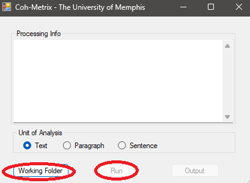

```{r setup, include=FALSE}
knitr::opts_chunk$set(
  collapse = TRUE,
  comment = "#>",
  # Run chunks locally/CI when NOT_CRAN=true; skip on CRAN
  eval = identical(Sys.getenv("NOT_CRAN"), "true")
)
```

> A practical walkthrough of the key functions in **writeAlizer**: importing analysis outputs (ReaderBench, Coh‑Metrix, GAMET), and running predictive models with `predict_quality()`.

## Background
The **writeAlizer** package downloads predictive models for writing quality and written-expression CBM scores and applies these models to your data. Predicted writing quality scores can be generated from ReaderBench or Coh-Metrix output files. Predicted written expression CBM scores, total words written (TWW), words spelled correctly (WSC), correct word sequences (CWS), and correct minus incorrect word sequences (CIWS), can be generated from GAMET output files.

More details on model development can be found in the **writeAlizer** [wiki](https://github.com/shmercer/writeAlizer/wiki).

---

### Prerequisites
writeAlizer accepts the following output files as inputs:

1. ReaderBench: writeAlizer supports output files (.csv format) generated from the Java version of ReaderBench. [Source Code](https://github.com/readerbench/readerbench-java) [Windows Binaries](https://osf.io/wyq4t)
 
2. Coh-Metrix: writeAlizer supports output files from Coh-Metrix version 3.0 (.csv format). [Request a Copy of Coh-Metrix](https://soletlab.asu.edu/coh-metrix/)
 
3. GAMET: writeAlizer supports output files from GAMET version 1.0 (.csv format). [Download for Windows and Mac](https://www.linguisticanalysistools.org/gamet.html)

The writeAlizer scoring models assume that column names in the output files have been unchanged (exactly the same as generated from the program). For programs that list file paths in the first column, the writeAlizer file import functions will parse the file names from the file paths and store the file names as an identification variable (ID). `import_rb()` (ReaderBench) and `import_coh()` (Coh-Metrix) keep IDs as **character**. For ReaderBench CSVs, the original `File.name` column is renamed to `ID` and stored as character. Numeric IDs are fine too, but they are not coerced to numeric to avoid losing leading zeros or other formatting.

---

### File Setup
ReaderBench, Coh-Metrix, and GAMET all accept a folder of text files (.txt) as inputs, with the filenames read as ID variables for the writing samples. 

#### File Format and Windows-Specific Encodings {#encoding}

To avoid encoding issues in R and other programs, always save text files as UTF-8. Text files created on Windows systems may sometimes use legacy encodings such as **Windows-1252** (also known as **CP1252**) rather than UTF-8.  

These encodings include typographic punctuation and symbols that are not part of standard ASCII and can cause problems when read on macOS or Linux systems, or by R functions that assume UTF-8 input.

Typical problematic characters include:

| Character | Description | Example |
|------------|--------------|----------|
| `‘` `’` | Curly (typographic) single quotes | e.g., `It’s` instead of `It's` |
| `“` `”` | Curly double quotes | e.g., `“Hello”` instead of `"Hello"` |
| `–` | En dash | e.g., `2010–2020` |
| `—` | Em dash | e.g., `Wait—what?` |
| `…` | Ellipsis | e.g., `and so on…` |
| `™`, `€`, `•` | Trademark, Euro, bullet symbols | e.g., `Product™`, `€100`, `• Item` |

Programs expecting UTF-8 may display these characters incorrectly (as “garbled” symbols) or fail to read the file entirely.

#### Detecting File Encoding

You can use the `readr` package to guess the encoding of a text file:

```r
library(readr)

# Detect the likely encoding of a text file
guess_encoding("example.txt")

# A tibble: 2 × 2
  encoding   confidence
  <chr>           <dbl>
1 UTF-8            0.95
2 windows-1252     0.05
```

#### Converting to UTF-8

If the file uses Windows-1252 or another legacy encoding, you can convert it safely to UTF-8:

```r
# Read and re-encode a text file
txt <- readLines("example.txt", encoding = "Windows-1252")
writeLines(txt, "example_utf8.txt", useBytes = TRUE)
```

Alternatively, you can use iconv() directly:

```r
txt <- readLines("example.txt")
txt_utf8 <- iconv(txt, from = "Windows-1252", to = "UTF-8")
writeLines(txt_utf8, "example_utf8.txt", useBytes = TRUE)
```

---

### Processing Files in ReaderBench

1. Download the [Windows binary](https://osf.io/wyq4t) or [build from source](https://github.com/readerbench/readerbench-java)

2. ReaderBench requires Java to run. The Java SE Runtime Environment can be downloaded [here](https://www.oracle.com/ca-en/java/technologies/javase/javase8u211-later-archive-downloads.html). After Java is installed the Java path must be set in Windows. To check if the Java path is set, open `Command Prompt` (cmd.exe), and run the following command:

```bash
java -version
```
You should see output similar to:

```bash
java version "1.8.0_451"
Java(TM) SE Runtime Environment (build 1.8.0_451-b10)
Java HotSpot(TM) 64-Bit Server VM (build 25.451-b10, mixed mode)
```
If no Java version is returned, follow the [instructions below for setting the Java Path](#java-path).

3. Unzip and open the ReaderBench folder. Click on 'run.bat'. A screen similar to the one below should appear. If it appears briefly and then closes, [double check that the Java path is specified correctly](#java-path).


4. Click on Textual Complexity -> Run Textual Complexity Indices


5. Specify the path to the folder containing your writing sample .txt files.


6. The output .csv will appear in that same folder after processing is complete.

#### Setting the Java Path in Windows {#java-path}

1. Open **File Explorer** and navigate to (or the directory Java is installed in):

```bash
C:\Program Files\Java\
```

2. Inside, locate your Java folder — for example: 

```bash
C:\Program Files\Java\jre1.8.0_451
```

Copy this full path. You’ll need it in the next step.

3. Set `JAVA_HOME` (via Windows Settings)

- Press **Windows + R**, type `sysdm.cpl`, and press **Enter**.  
- Go to the **Advanced** tab → click **Environment Variables**.  
- Under **System variables**, click **New...**
-- **Variable name:** `JAVA_HOME`
-- **Variable value:** paste your Java path (e.g., `C:\Program Files\Java\jre1.8.0_451`)
- Click **OK** to save.

4. Add Java to your system Path

- In the same **Environment Variables** window, find and select the variable named **Path**, then click **Edit**.  
- Click **New**, and add the following entry: `%JAVA_HOME%\bin`

5. In **Command Prompt**, check the Java version with this command: 

```bash
java -version
```
Also check your environment variable. It should print your Java installation directory.

```bash
echo %JAVA_HOME%
```

---

### Processing Files in Coh-Metrix

1. Request a copy of `Coh-Metrix` here (available for research purposes): <https://soletlab.asu.edu/coh-metrix/>

2. Run `CohMetrix3.exe` in the Release folder.

3. Click on `Coh-Metrix`.


4. Select the folder containing your `.txt` files to be processed and click on `Run`.



5. `Coh-Metrix` will prompt you to enter a filename for the output file. Make sure it is located outside of the working folder to be processed. If you receive an error message like the one below, click `Continue` and try again. If the error is persistent, click on `Quit` and restart Coh-Metrix.


---

### Processing Files in GAMET

1. Download the GAMET program and manual from: <https://www.linguisticanalysistools.org/gamet.html>

2. After loading, 'Select All' error indices and follow the on-screen directions.


3. If some `.txt` files do not process, double check [file encoding](#encoding).

---

## Installing writeAlizer
**writeAlizer** is available on CRAN.
```r
install.packages("writeAlizer")

library(writeAlizer)
```

To install the development version of **writeAlizer**:
```r
# From GitHub

#using the pak package
#install.packages("pak")
pak::pak("shmercer/writeAlizer")

#or using devtools
#install.packages("devtools")
devtools::install_github("shmercer/writeAlizer")

library(writeAlizer)
```

---

### Optional model dependencies
Running models requires packages listed in **Suggests**. Discover what you need:

```r
md <- writeAlizer::model_deps()
md$required   # packages already available
md$missing    # packages you may want to install for full functionality
```

`model_deps()` prints a helpful message. If any packages are missing, it includes a copy-paste command like:

```r
Missing required packages: glmnet, ranger
Install them manually, e.g.:
  install.packages(c("glmnet", "ranger"))
```

---

## Quick start
This minimal example shows how to import a small sample dataset that ships with the package and run a model.

```r
# Load a small ReaderBench sample shipped with the package
rb_path <- system.file("extdata", "sample_rb.csv", package = "writeAlizer")
rb <- import_rb(rb_path)
head(rb)

# Example: run a ReaderBench predictive model (model artifacts will be downloaded on the first run)
quality <- predict_quality("rb_mod3all", rb)
head(quality)
```

---

## Importing data
**About the examples below:** each code snippet loads a **small example CSV** that ships with the package using `system.file(...)`. Replace with paths to your own files when running analyses on your data.
`writeAlizer` expects CSV outputs from ReaderBench, Coh-Metrix, and/or GAMET as inputs. Use the matching import helper for each format:

```r
# ReaderBench CSV	
rb_path  <- system.file("extdata", "sample_rb.csv",    package = "writeAlizer")
rb  <- import_rb(rb_path)

# Coh‑Metrix CSV	
coh_path <- system.file("extdata", "sample_coh.csv",   package = "writeAlizer")
coh <- import_coh(coh_path)

# GAMET CSV      	
gam_path <- system.file("extdata", "sample_gamet.csv", package = "writeAlizer")
gam <- import_gamet(gam_path)

# Peek at structure
str(rb)
str(coh)
str(gam)

# ------------------------------------------------------------------
# Example: loading your own files instead of the built-in samples
# ------------------------------------------------------------------

# Example file paths (replace with your actual paths)
# rb_path  <- "C:/Users/YourName/Documents/Files/ReaderBench_output.csv"
# coh_path <- "C:/Users/YourName/Documents/Files/CohMetrix_output.csv"
# gam_path <- "C:/Users/YourName/Documents/Files/GAMET_output.csv"

# Import your own CSVs
# rb  <- import_rb(rb_path)
# coh <- import_coh(coh_path)
# gam <- import_gamet(gam_path)
```

All three imports return a `data.frame` with an `ID` column; `predict_quality()` relies on that `ID` to keep rows aligned in outputs.

---

## Predicting writing quality
Use `predict_quality(model, data)` to run one of the built‑in model families:

- **ReaderBench**: `rb_mod1`, `rb_mod2`, `rb_mod3narr`, `rb_mod3exp`, `rb_mod3per`, `rb_mod3all`
- **Coh‑Metrix**: `coh_mod1`, `coh_mod2`, `coh_mod3narr`, `coh_mod3exp`, `coh_mod3per`, `coh_mod3all`
- **GAMET** (TWW/WSC/CWS/CIWS): `gamet_cws1`
- **Offline demo**: `example`

### Examples

```r
# ReaderBench -> holistic quality
rb_quality <- predict_quality("rb_mod3all", rb)
head(rb_quality)

# Coh‑Metrix -> holistic quality
coh_quality <- predict_quality("coh_mod3all", coh)
head(coh_quality)

# GAMET -> TWW, WSC, CWS, and CIWS
gamet_scores <- predict_quality("gamet_cws1", gam)
head(gamet_scores)
```

**Return value.** A `data.frame` with `ID` plus one column per sub‑model prediction (prefixed `pred_`). When there are multiple numeric prediction columns (and the model isn’t `gamet_cws1`), a row‑wise mean column (e.g., `score_mean`) is added to summarize overall quality.

---

## Available models at a glance (with references)
Use this table to pick a model and keep track of published uses. Fill the **References** column with citations (e.g., “Smith & Lee, 2022; doi:…”) as you go.

| Model key        | Data source / import | Target(s) predicted                  | Output columns (typical)                       | Notes/References (published uses) |
|---|---|---|---|---|
| `rb_mod1`        | ReaderBench → `import_rb()` | Holistic writing quality               | `ID`, `pred_rb_mod1`, `score_mean`    | [@Keller-Margulis2022; @Matta2022; @Mercer2022] |
| `rb_mod2`        | ReaderBench → `import_rb()` | Holistic writing quality               | `ID`, `pred_rb_mod2`, `score_mean`    | This is a simplified version of rb_mod1 that handles errors on multi-paragraph compositions. [@Matta2023] |
| `rb_mod3narr`    | ReaderBench → `import_rb()` | Narrative genre quality                | `ID`, `pred_rb_mod3narr`, `score_mean`| — |
| `rb_mod3exp`     | ReaderBench → `import_rb()` | Expository genre quality               | `ID`, `pred_rb_mod3exp`, `score_mean` | — |
| `rb_mod3per`     | ReaderBench → `import_rb()` | Persuasive genre quality               | `ID`, `pred_rb_mod3per`, `score_mean` | — |
| `rb_mod3all`     | ReaderBench → `import_rb()` | Holistic (all‑genre) quality           | `ID`, `pred_rb_mod3all`, `score_mean` | *Recommended ReaderBench model for use |
| `coh_mod1`       | Coh‑Metrix → `import_coh()`  | Holistic writing quality               | `ID`, `pred_coh_mod1`, `score_mean`   | [@Keller-Margulis2022; @Matta2022] |
| `coh_mod2`       | Coh‑Metrix → `import_coh()`  | Holistic writing quality               | `ID`, `pred_coh_mod2`, `score_mean`   | This is a simplified version of coh_mod1 |
| `coh_mod3narr`   | Coh‑Metrix → `import_coh()`  | Narrative genre quality                | `ID`, `pred_coh_mod3narr`, `score_mean`| — |
| `coh_mod3exp`    | Coh‑Metrix → `import_coh()`  | Expository genre quality               | `ID`, `pred_coh_mod3exp`, `score_mean`| — |
| `coh_mod3per`    | Coh‑Metrix → `import_coh()`  | Persuasive genre quality               | `ID`, `pred_coh_mod3per`, `score_mean`| — |
| `coh_mod3all`    | Coh‑Metrix → `import_coh()`  | Holistic (all‑genre) quality           | `ID`, `pred_coh_mod3all`, `score_mean`| *Recommended Coh-Metrix model for use |
| `gamet_cws1`     | GAMET → `import_gamet()`     | `TWW`, `WSC`, `CWS`, and `CIWS`        | `ID`, `pred_cws`, `pred_ciws`         | [@Matta2025; @Mercer2021] |
| `example`        | Any (demo)                   | Minimal demo score(s)                  | `ID`, `pred_example`, `score_mean?`   | Offline, CRAN‑safe mock; seeded via `wa_seed_example_models("example")`|

---

## Working with the model download cache
The package downloads and caches model artifacts the first time you use a model.

```r
# See where model artifacts are cached
writeAlizer::wa_cache_dir()

# Clear cache if needed 
writeAlizer::wa_cache_clear()
```

---

## References
